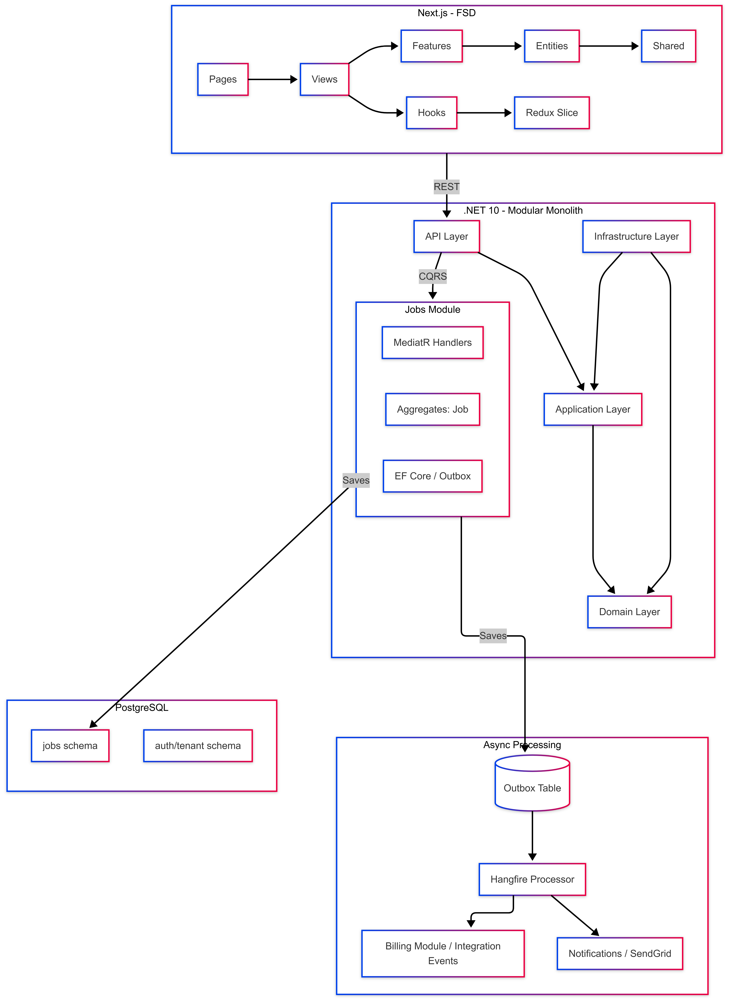

# JobTracker - Technical Assessment

## Project Overview
JobTracker is a multi-tenant job management system for a roofing company. It uses a **Modular Monolith** backend (.NET 10) and a **Feature Sliced Design (FSD)** frontend (Next.js 15).

## 6.1 Architecture Diagram

[View Architecture Diagram on Mermaid Live](https://mermaid.ai/d/385635bc-7e82-4eea-a317-b49e4f3b984f)

## 6.2 Design Principles Analysis

### SOLID Principles
1. **Single Responsibility (S):** `CreateJobCommandHandler` only handles the orchestration of creating a job. It doesn't know about HTTP or Database specifics.
2. **Open/Closed (O):** The use of `MediatR` allows adding new functionality (e.g., new commands or event handlers) without modifying existing command dispatchers.
3. **Liskov Substitution (L):** `Job` and `JobPhoto` inherit from `Entity`, and any service expecting an `Entity` can handle either without knowing the specific type for basic operations like event clearing.
4. **Interface Segregation (I):** `IJobRepository` defines only the methods needed for Job persistence, keeping it focused compared to a generic repository.
5. **Dependency Inversion (D):** High-level Application layers depend on the `IJobRepository` interface (defined in Domain), while the low-level Infrastructure layer implements it.

### GRASP Principles
1. **Information Expert:** The `Job` aggregate root is the information expert for its own state transitions (e.g., `Complete()` method).
2. **Creator:** `Job.Create()` static factory method acts as the creator for the Job instances, ensuring invariants from the start.
3. **Controller:** `MediatR` handlers act as controllers for the application logic.

### Cross-cutting Concepts
1. **Idempotency:** Guaranteed in the outbox processor by tracking `ProcessedOnUtc`. Integration event handlers use a unique `EventId` or `JobId + State` as an idempotency key.
2. **Eventual Consistency:** Achieved through the Outbox pattern. State changes in the database and event publication happen in separate steps but are guaranteed to eventually happen.
3. **Bounded Context:** `Jobs` and `Billing` are separate bounded contexts. They communicate via `Integration Events` to maintain loose coupling.
4. **Open Host Service (OHS):** The `Jobs.IntegrationEvents` project serves as a public contract that other modules can consume.

## 6.3 GoF Design Patterns

| Pattern | Where Used | Problem Solved |
|---------|-----------|---------------|
| **Repository** | `IJobRepository` | Abstracts data access and enables easier unit testing. |
| **Unit of Work** | `IUnitOfWork` (via DbContext) | Ensures all changes in a transaction are committed together. |
| **Mediator** | `MediatR` | Decouples the sender of a command/query from its handler. |
| **Factory Method** | `Job.Create()` | Centralizes the creation of complex Aggregate Roots with initial state. |
| **Strategy** | `FluentValidation` | Encapsulates validation logic into separate classes that can be easily swapped or extended. |
| **Observer** | `Domain Events` | Allows different parts of the system to react to state changes without tight coupling. |

## Setup Instructions
1. **Backend:**
   - Navigate to `/backend`
   - Run `dotnet restore`
   - Run `dotnet build`
2. **Frontend:**
   - Navigate to `/frontend`
   - Run `npm install`
   - Run `npm run dev`
3. **Infrastructure:**
   - Use the `docker-compose.yml` (if provided) to spin up PostgreSQL.
